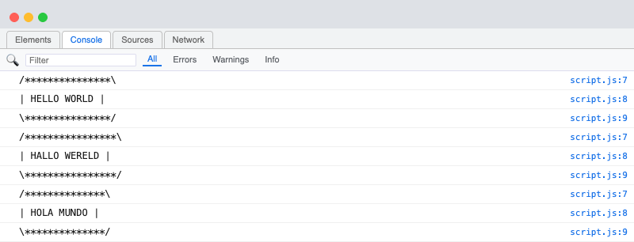
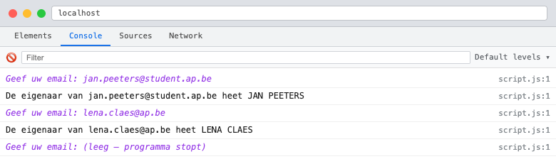
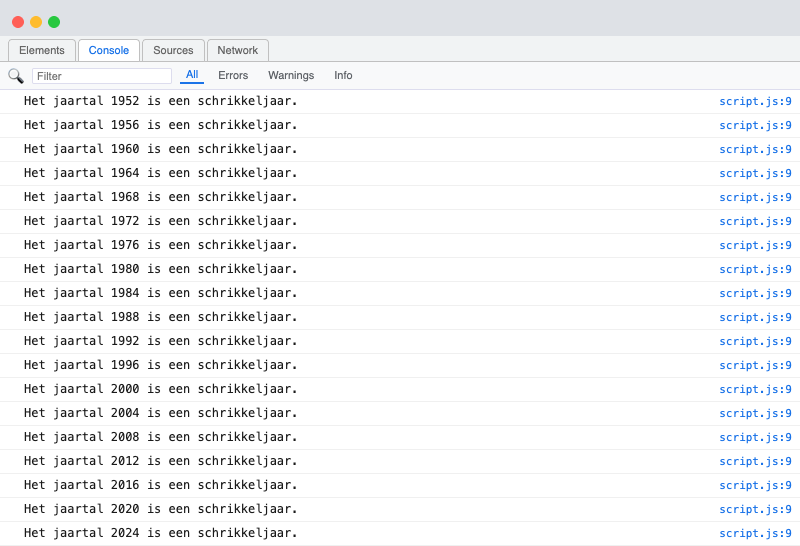
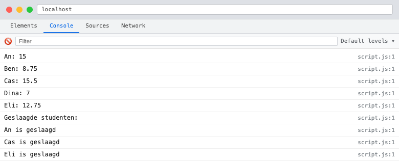
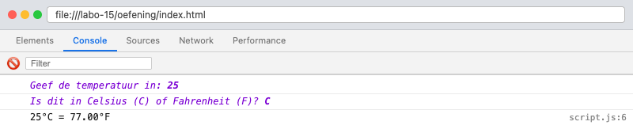
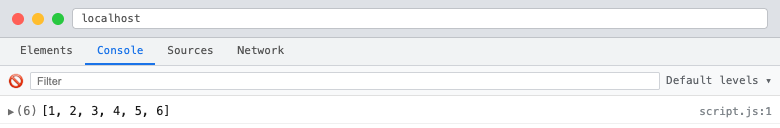
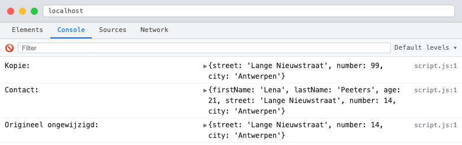
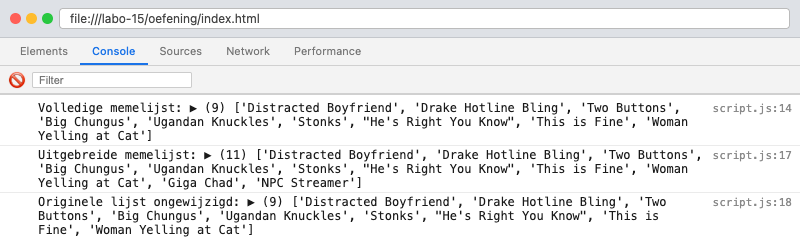

# Labo 15

Zorg dat je de volgende folderstructuur volgt:

```
webtechnologie/
├─ labo-01/
│  ├─ oefening-01/
│  │  ├─ index.html
│  │  ├─ images/
│  │  │  ├─ image-1.jpg 
│  │  │  └─ image-n.jpg 
│  │  ├─ css/
│  │  │   ├─ reset.css
│  │  │   └─ style.css
│  │  ├─ data/
│  │  │   ├─ datafile-1.json
│  │  │   └─ datafile-2.json
│  │  └─ js/
│  │     └─ script.js
│  ├─ oefening-02/
│  └─ oefening-n/
├─ labo-02/
└─ labo-n/      
```

- Gebruik steeds JS modules om globale variabelen te vermijden (`<script type="module" src="./path/to/script.js"></script>`)
- Volg de [Coding Guidelines](https://apwt.gitbook.io/webtechnologie/coding-guidelines)

## Oefeningen functies

### oefening 1: opwarmers
Schrijf de volgende functies om aan te tonen dat je alle concepten onder de knie hebt:

* Schrijf een functie zonder argumenten die een getal teruggeeft.
* Schrijf een functie zonder argumenten die een string teruggeeft.
* Schrijf een functie zonder argumenten die een boolean teruggeeft.
* Schrijf een functie zonder argumenten die een string afprint in de console.
* Schrijf een functie met twee argumenten (twee getallen) die een getal op het scherm afprint. Het getal dat wordt getoond moet iets doen met deze twee getallen.

### oefening 2: text-box-functie

#### leerdoelen

* input lezen
* schrijven van eigen functies

#### functionele analyse

Je programma toont een stuk tekst in je console in een tekstvak

#### technische analyse

Je kan de code om een box te tekenen hergebruiken uit labo-12, oefening 13. Je moet ze wel nog omzetten naar een functie.

Je maakt een functie `printTextBox` met een string als parameter. De functie toont de tekst in het tekstvak.

Je roept de functie een aantal keer aan met verschillende parameters.

#### voorbeeldinteractie



### oefening 3: name-from-email-functie

#### leerdoelen

* input lezen
* lussen
* schrijven van eigen functies

#### functionele analyse

Het programma toont het gedeelte van de e-mailadres dat de naam voorstelt.

#### technische analyse

Je kan de code hergebruiken uit labo-12, oefening 11. Je moet ze opnieuw nog omzetten naar een functie.

Je maakt een functie `nameFromEmail` met 1 parameter die een email adres bevat. Deze functie geeft de voor en de achternaam terug in hoofdletters.

Je vraagt de gebruiker op een interactieve manier achter zijn email adres.

Je blijft een email adres vragen totdat deze een lege string ingeeft.

#### voorbeeldinteractie



### oefening 4: schrikkeljaar-functie

#### leerdoelen

* gebruiken van lussen
* schrijven van eigen functies

#### functionele analyse

Je programma toont een overzicht van alle schrikkeljaren tussen 1950 en het huidige jaartal.

#### technische analyse

Je kan code herbruiken uit labo-13, oefening 2.

Je maakt een functie `isLeapYear` die 1 parameter aanvaardt met het jaartal en de functie geeft true terug als het een schrikkeljaar is en false als het geen schrikkeljaar is. Reminder: een schrikkeljaar is elk veelvoud van 400, alsook elk ander getal dat een veelvoud is van 4 maar niet van 100.

Je gebruikt een lus om voor de jaartallen tussen 1950 en dit jaar te berekenen of het een schrikkeljaar is of niet. Je print het jaar af als het een schrikkeljaar is.

Je kan het huidige jaar verkrijgen met de volgende code

```js
new Date().getFullYear();
```

#### voorbeeldinteractie



### oefening 5: array-sum

#### leerdoelen

* gebruiken van lussen
* schrijven van eigen functies
* arrays

#### functionele analyse

Je programma berekent de som van een array

#### technische analyse

Je maakt een functie `sum` die een array inneemt als parameter.

Print in deze functie eerst de array af met `console.log`;

Deze functie zal een `for` lus bevatten die de som berekent van de getallen in de array.

Deze functie geeft de som van de getallen in de array terug.

#### voorbeeldinteractie


### oefening 6: studentenresultaten

#### leerdoelen

* functies schrijven met een array als parameter
* werken met arrays van objecten
* functies die gebruik maken van andere functies

#### functionele analyse

Het programma verwerkt een lijst van studenten met hun punten en berekent statistieken.

#### technische analyse

Gebruik de volgende array:

```js
const students = [
    { name: "An",   grades: [14, 16, 12, 18] },
    { name: "Ben",  grades: [9,   7, 11,  8] },
    { name: "Cas",  grades: [15, 17, 14, 16] },
    { name: "Dina", grades: [6,   8,  5,  9] },
    { name: "Eli",  grades: [13, 11, 15, 12] },
];
```

1. Schrijf een functie `calculateAverage(grades)` die het gemiddelde berekent van een array van punten (afgerond op 2 decimalen).
2. Gebruik `calculateAverage` in een lus om de naam en het gemiddelde van elke student in de console te printen.
3. Schrijf een functie `getPassingStudents(students)` die een nieuwe array teruggeeft van studenten met een gemiddelde van 10 of meer.
4. Print de namen van de geslaagde studenten.

#### voorbeeldinteractie



### oefening 7: omrekenen van graden

#### leerdoelen

* schrijven van eigen functies
* rekenkundige operaties

#### functionele analyse

Schrijf een programma dat temperaturen kan omrekenen tussen Celsius en Fahrenheit.

#### technische analyse

- Vraag de gebruiker om een temperatuur en een eenheid (C of F).
- Gebruik een functie die:
    - Celsius omzet naar Fahrenheit met de formule: (C × 9/5) + 32
    - Fahrenheit omzet naar Celsius met de formule: (F - 32) × 5/9
- Toon de omgezette waarde in de console.
- Geef een foutmelding als de eenheid niet correct is ingevoerd.

#### voorbeeldinteractie



## Spread operator

### oefening 8: gebruik van de spread operator

#### leerdoelen

* begrijpen hoe de spread-operator werkt.
* kunnen toepassen van de spread-operator om arrays samen te voegen en te kopiëren.

#### functionele analyse

Schrijf een JavaScript-functie genaamd `mergeArrays` die twee arrays accepteert en een nieuwe array retourneert waarin de elementen van beide arrays zijn samengevoegd. Gebruik de spread-operator om de arrays samen te voegen.

#### technische analyse

1. Schrijf een functie genaamd `mergeArrays` die twee parameters (arrays) accepteert.
2. Gebruik de spread-operator om beide arrays samen te voegen in een nieuwe array.
3. Lees het resultaat uit in de console.

#### voorbeeldinteractie



### oefening 9: spread operator met objecten

#### leerdoelen

* spread-operator gebruiken om objecten te kopiëren
* spread-operator gebruiken om objecten samen te voegen
* begrijpen dat spread een kopie maakt (geen referentie)

#### functionele analyse

Het programma maakt kopieën en combineert objecten met de spread-operator.

#### technische analyse

Gebruik de volgende objecten:

```js
const address = { street: "Lange Nieuwstraat", number: 14, city: "Antwerpen" };
const person  = { firstName: "Lena", lastName: "Peeters", age: 21 };
```

1. Maak een kopie van `address` met de spread-operator en verander het huisnummer naar 99.
2. Voeg `address` en `person` samen tot één nieuw object `contact` met de spread-operator.
3. Print de kopie, `contact` en het originele `address` af in de console.
4. Toon dat het originele `address` object ongewijzigd is.

#### voorbeeldinteractie



### oefening 10: memes combineren met rest-parameters

#### leerdoelen

* rest-parameters gebruiken in functies (`...args`)
* spread-operator gebruiken in combinatie met functies
* aantonen dat spread een kopie maakt (geen referentie)

#### functionele analyse

Het programma combineert lijsten van memes uit verschillende categorieën tot één grote memelijst.

#### technische analyse

Gebruik de volgende arrays:

```js
const classicMemes   = ["Distracted Boyfriend", "Drake Hotline Bling", "Two Buttons"];
const deepFriedMemes = ["Big Chungus", "Ugandan Knuckles", "Stonks"];
const currentMemes   = ["He's Right You Know", "This is Fine", "Woman Yelling at Cat"];
```

1. Schrijf een functie `combineMemes(...memeCategories)` die een variabel aantal arrays ontvangt en ze samenvoegt tot één array met de spread-operator.
2. Roep de functie aan met de drie arrays, sla het resultaat op in `fullMemeList` en print de lijst af.
3. Maak een kopie van `fullMemeList` met de spread-operator en voeg twee extra memes toe aan de kopie.
4. Print beide lijsten af en toon dat `fullMemeList` ongewijzigd is.

#### voorbeeldinteractie


